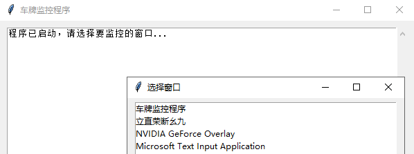
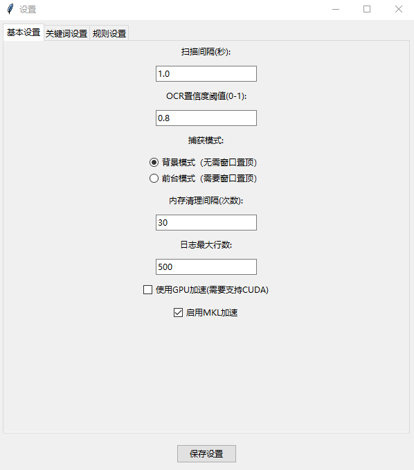
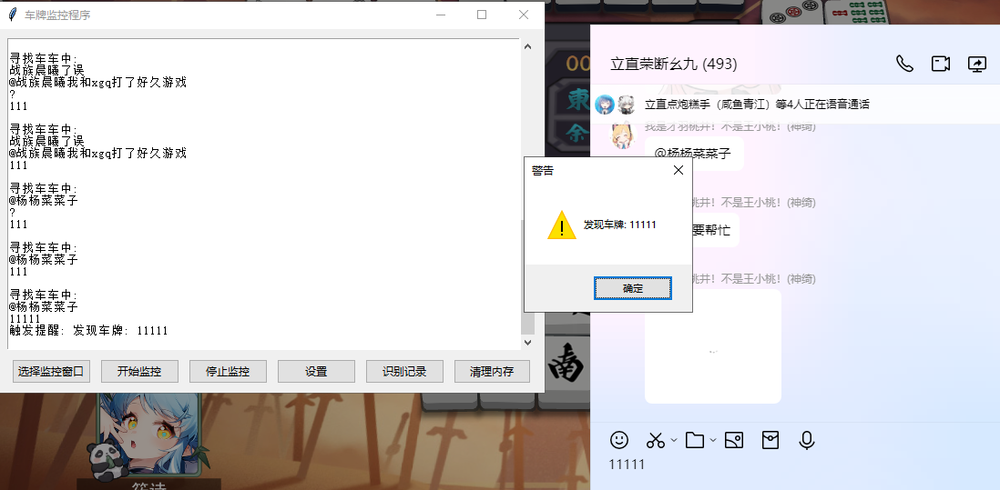
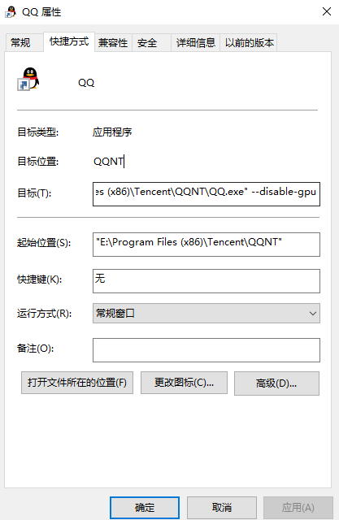

# 雀魂群友人场监控工具

一个基于 PaddleOCR 的监控聊天窗口的工具，可以实时监控指定窗口区域并识别字符，制作原因是群友友人场车牌总是赶不上，写个脚本懒人化，不用一直盯着窗口。

## 功能特点

- 实时监控指定窗口区域
- 自动识别雀魂友人场车牌号码（5位数字），识别过的不会重复识别
- **支持背景捕获模式，无需窗口置顶即可监控**（新增）
- **支持一键切换窗口置顶状态**（新增）
- 支持自定义关键词监控
- 可视化区域选择
- 支持设置扫描间隔和OCR置信度
- 弹窗提醒功能

## 安装依赖

```bash
# 创建虚拟环境
python -m venv .venv

# 激活虚拟环境
.venv\Scripts\activate

# 安装依赖
pip install -r requirements.txt
```

其实核心依赖就这几个，也可以直接安装：
```bash
pip install paddlepaddle
pip install "paddleocr>=2.0.1"
pip install pillow
pip install opencv-python
pip install pywin32
pip install psutil
pip install comtypes
```

如果安装过程中遇到问题，可以尝试先安装这些核心包，程序也能正常运行。其他依赖包会在安装这些核心包时自动安装。

## 使用方法

#### 直接运行
```bash
# 激活虚拟环境
.venv\Scripts\activate

# 运行启动器
python main.py
```

#### 打包使用
1. 打包程序
```bash
# 激活虚拟环境
.venv\Scripts\activate

# 安装打包工具
pip install PyInstaller

# 打包命令
python -m PyInstaller --name "车牌监控" --add-data "config.py;." --add-data "quehun.ico;." --add-data "utils.py;." --add-data "gui;gui" --add-data "monitor;monitor" --add-data "ocr;ocr" --add-data ".venv\Lib\site-packages\paddle\libs\*.dll;paddle\libs" --add-data ".venv\Lib\site-packages\paddleocr;paddleocr" --hidden-import paddleocr --hidden-import PIL --hidden-import cv2 --hidden-import win32gui --hidden-import win32ui --hidden-import win32con --hidden-import numpy --hidden-import psutil --hidden-import comtypes --hidden-import comtypes.client --hidden-import time --collect-all paddleocr --collect-all paddle --collect-all comtypes --noconsole --icon=quehun.ico main.py
```


2. 运行打包后的程序
- 打包完成后，在 `dist/车牌监控` 目录下找到 `车牌监控.exe`
- 双击运行即可

3. 或者下载我提供打包好的程序（包有点大是因为包含了模型文件）
-  度盘:https://pan.baidu.com/s/1WQk_5grMdjUJ5-7CzskXTg?pwd=wz2l 
-  提取码：wz2l


## 使用说明

1. 选择监控窗口
   - 点击"选择监控窗口"按钮
   - 从列表中选择要监控的窗口
   - 用鼠标框选要监控的区域

   
   

2. 设置窗口置顶（可选）
   - 选择窗口后，可以点击"切换窗口置顶"按钮
   - 在前台模式下建议启用窗口置顶
   - 在背景模式下可以不需要置顶

3. 选择捕获模式（可选）
   - 点击"切换捕获模式"按钮可以在两种模式间切换：
     - 背景模式：无需窗口置顶，能监控被其他窗口遮挡的内容
     - 前台模式：需要窗口置顶，适用于背景模式无法正常工作的情况

4. 开始监控
   - 点击"开始监控"按钮
   - 程序会自动识别区域内的文字
   - 发现目标内容时会弹窗提醒

   
   

5. 设置选项
   - 点击"设置"按钮可以：
     - 调整扫描间隔
     - 设置OCR置信度
     - 管理关键词列表
     - 设置捕获模式（背景/前台）

   
   
   

6. 停止监控
   - 点击"停止监控"按钮
   - 或直接关闭程序

7. 最终效果
   
   

## 配置文件说明

`config.py` 包含以下配置项：
- MONITOR_SETTINGS：监控设置（窗口标题、扫描间隔、置信度阈值、捕获模式）
- OCR_SETTINGS：OCR引擎设置
- RULES：规则设置（关键词、数字模式、排除规则）

## 捕获模式说明

程序提供两种捕获模式：

1. **背景模式**（默认）
   - 优点：可以监控被其他窗口遮挡的窗口，不需要保持窗口在最前面
   - 适用：日常使用，后台监控
   - 技术：使用高级Windows API直接获取窗口内容

2. **前台模式**
   - 优点：兼容性更好，对所有窗口都有效
   - 缺点：需要窗口置顶才能正常工作
   - 适用：当背景模式无法捕获某些特殊窗口内容时

可以随时通过"切换捕获模式"按钮或设置界面切换这两种模式。

## 注意事项

- 在背景模式下，被监控的窗口可以被其他窗口遮挡，注意不要最小化，QQ不支持背景模式（鬼知道为什么），推荐用TIM，占用小，支持后台监控
- 在前台模式下，被监控的窗口需要保持在最前面（可以使用"切换窗口置顶"按钮）
- 首次运行时需要下载OCR模型文件
- 建议使用虚拟环境运行程序
- GPU设置支持需要修改环境重新打包（改为安装paddlepaddle-gpu，具体安装方法见https://www.paddlepaddle.org.cn/install/quick?docurl=/documentation/docs/zh/install/pip/windows-pip.html）
- QQ高版本需要禁止GPU，不然不能监控（~~天知道为什么一个聊天软件需要GPU~~），可以使用快捷方式修改如下图（前面是你的QQ路径）（"E:\Program Files (x86)\Tencent\QQNT\QQ.exe" --disable-gpu）
- 


## 依赖项目

- PaddleOCR
- OpenCV
- PyWin32
- Tkinter
- NumPy
- Pillow
- psutil
- comtypes（新增，用于DWM缩略图捕获）

## License

MIT License

最后，本人雀魂名 筱诗 id 47739304 欢迎加好友一起打牌
